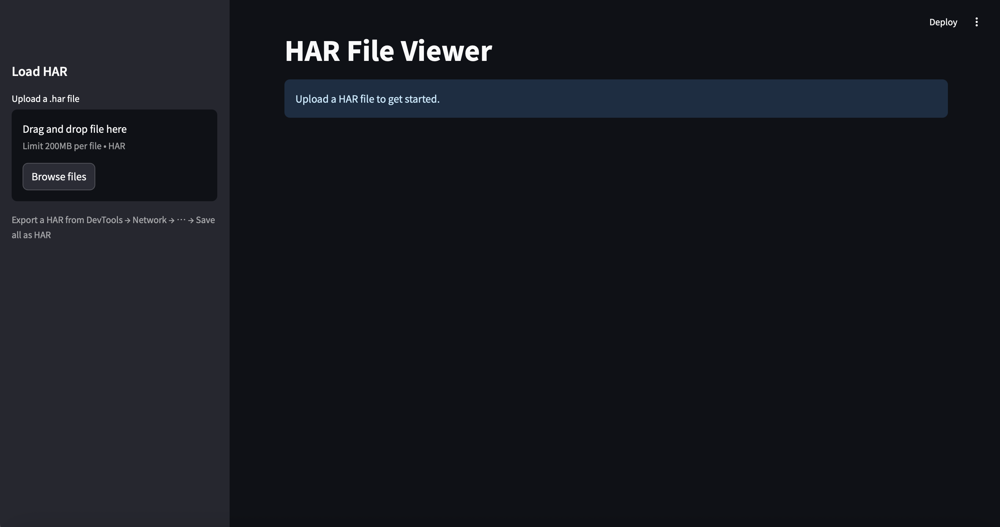
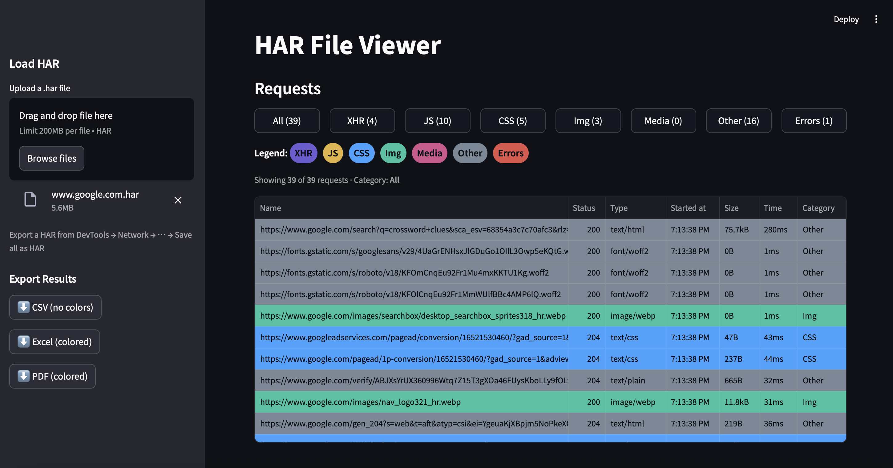
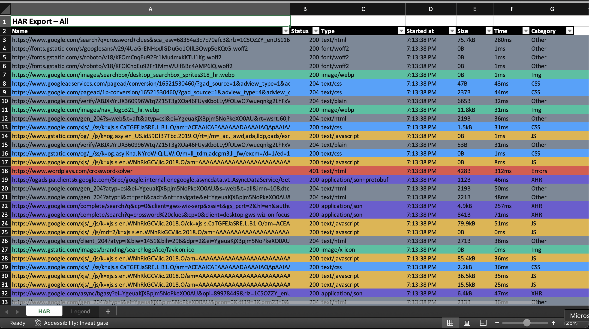
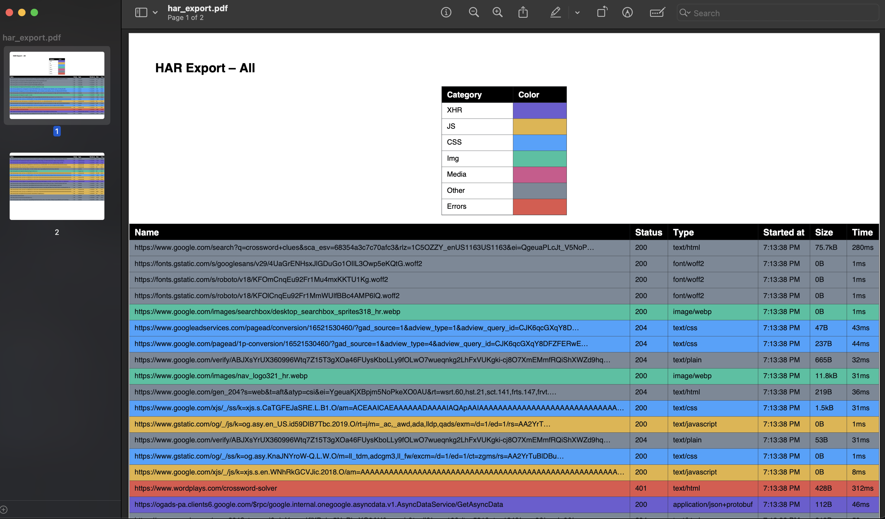

<<<<<<< HEAD
# tag-audit-tool
Streamlit-based HAR analyzer for auditing pre-consent requests, cookies, and tag chains (with diff mode).
=======
# HAR File Viewer

A lightweight **Streamlit web app** for inspecting HAR (HTTP Archive) files with a clean, dark-mode UI.  
It provides **color-coded tables**, category filters, and export options (CSV, Excel, PDF) so you can easily audit web requests — including checking if **JavaScript tags fire before user consent**.



---

## ✨ Features

- 📂 Upload `.har` files (up to 200MB)
- 🏷️ Automatic request categorization:
  - **XHR** (AJAX/JSON)
  - **JS** (JavaScript)
  - **CSS**
  - **Img**
  - **Media**
  - **Other**
  - **Errors**
- 🎨 Color-coded table rows by category (JS = amber, CSS = blue, etc.)
- 🔍 Filters by category (All, JS, CSS, …)
- ⏱️ Columns: **Name, Status, Type, Started at, Size, Time, Category**
- 📊 Export:
  - **CSV (no colors)**
  - **Excel (.xlsx, with colored rows + Legend sheet)**
  - **PDF (colored table + Legend)**
- 🛡️ Built for **consent compliance auditing** — quickly spot tags that fire pre-consent

---

## 🚀 Installation

Clone the repo and install dependencies:

- ```git clone https://github.com/your-org/har-file-viewer.git```
- ```cd har-file-viewer```
- ```pip install -r requirements.txt```

## ▶️ Usage

Run the Streamlit app:

```streamlit run har_viewer.py```

- Then open your browser (default: http://localhost:8501).
- **1.	Export a HAR from Chrome/Edge/Firefox:**
DevTools → Network tab → ⋯ menu → Save all as HAR
-	**2.	Upload the .har file in the sidebar**
- **3. Browse requests, filter by type, and export results**

## 📂 Project Structure
```
.
├── har_viewer.py      # Main Streamlit app
├── requirements.txt   # Dependencies
├── README.md          # Documentation
└── Screenshot 2025-08-26 at 3.10.49 PM.png     # Example UI screenshot
```
## 🖼️ Screenshots

## Main Viewer
****

Dark-themed table with filters and category colors.

## Excel Export (colored)


Rows shaded by request type, with a separate Legend tab.

## PDF Export (colored)


Print-friendly report, with legend and full request table.

## ⚖️ Compliance Use Case
This tool was built to help companies prove they don’t fire tracking tags before consent.
By analyzing HAR files before and after user interaction with a Consent Management Platform (CMP), you can generate evidence for GDPR/CCPA compliance.

## 🔮 Roadmap
- Pre-consent / post-consent analysis mode
- Automatic cookie & localStorage detection
- Domain allow/deny lists for faster audits
- CLI mode for bulk scanning HAR files

## 📜 License
MIT License – use freely in your projects.
>>>>>>> b2a4879 (Initial commit: HAR Viewer with compliance & diff mode)
